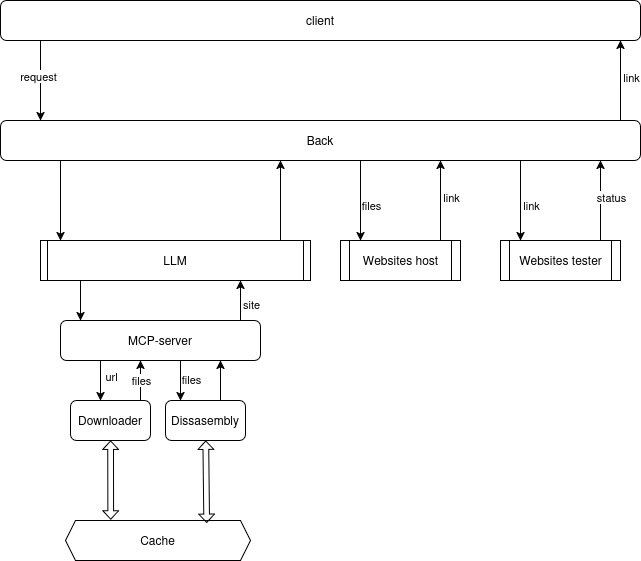

# MDLIV

**MDLIV** — команда, разработавшая AI-ассистента для модернизации дизайна и функциональности веб-сайтов.

---

## 📊 Презентация

[Посмотреть презентацию](https://www.figma.com/slides/CYD6pT1DHuUwG6V72m9SK3/min?t=WYkJrsANcA6bGQtB-6)

---

## ⚙️ Развертывание

### 🐳 Docker-развёртывание

**Требования:**
- Docker
- Docker Compose

**Инструкция:**
1. Сгенерируйте конфигурацию:
   ```bash
   docker compose config > docker-compose.yml
   ```
2. Запустите проект:
   ```bash
   docker compose up -d
   ```

---

### 🖥️ Локальное развёртывание

**Требования:**
- Python 3.11+
- Node.js 16+
- npm 9.5.1

#### Запуск компонентов:
1. **Frontend (React):**
   ```bash
   cd chat_ui
   npm i
   npm run dev  # Доступно на http://localhost:3000
   ```

2. **Backend (FastAPI):**
   ```bash
   pip install -r main_server/requirements.txt
   python main_server/start.py  # Доступно на http://localhost:8000
   python deploy_server/start.py  # Доступно на http://localhost:8080 (сервер для развертывания измененных сайтов)
   ```

3. **Прокси-сервер (Node.js):**
   ```bash
   cd proxy
   npm install
   node .  # Приложение доступно на http://localhost
   ```

---

## 🔁 Процесс обработки запросов



---

## 📦 API и отладка

**Swagger-документация:**  
[http://localhost:8000/api/docs](http://localhost:8000/api/docs)

---

## 🛠️ Используемые технологии

### Основной стек:
- **FastAPI** — высокопроизводительный фреймворк для API.
- **uvicorn** — ASGI-сервер для запуска FastAPI.
- **pydantic** — валидация данных через аннотации типов.
- **httpx** — асинхронные HTTP-запросы.
- **requests** — синхронные HTTP-запросы.
- **asyncio** — асинхронное выполнение задач.
- **llama_cpp_python** — интеграция LLM через C++ биндинги.
- **openai** — доступ к GPT и другим моделям OpenAI.
- **huggingface-hub** — работа с моделями Hugging Face.
- **fastapi-controllers** — структурирование контроллеров.

### Вспомогательные инструменты:
- **jsbeautifier** — форматирование JS/CSS/HTML.
- **pywebcopy** — копирование веб-контента.
- **lxml** — парсинг HTML/XML.
- **cachecontrol** — управление кэшированием.

---
